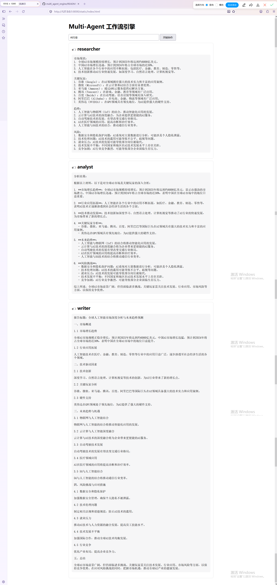

# Multi-Agent 工作流引擎

一个基于 **Python + FastAPI + OpenAI 兼容接口** 实现的轻量级 Multi-Agent 工作流引擎。
通过 **YAML 配置驱动**，将多个 AI Agent 编排成可执行的工作流，实现 **调研 → 分析 → 报告** 的端到端协作。

## ✨ 核心特性

- **Multi-Agent 协作**：研究员 / 分析师 / 写手 三个角色通过共享状态接力完成任务
- **配置驱动（Configuration Driven）**：Agent 定义与工作流流程全部外置到 YAML，改配置即可更换整套业务流，代码零改动
- **条件路由**：根据上一步运行结果动态选择分支（走 then / else），支持"失败自动重查"等自适应流程
- **真实 LLM 接入**：通过 OpenAI 兼容接口接入智谱 GLM，输出真实分析报告
- **执行日志**：`logging` 记录每步 Agent、耗时、结果长度，控制台 + 文件双输出，可观测

## 🏗 项目结构

```
multi_agent_engine/
├── app.py                  # FastAPI 服务入口（HTTP 接口 + 静态页面托管）
├── configs/
│   └── workflow.yaml       # 示例工作流配置（Agent 人设 + 流程编排）
├── myworkflow/
│   ├── __init__.py
│   ├── agent.py            # Agent 基类
│   ├── tool.py             # Tool 基类
│   ├── engine.py           # WorkflowEngine（状态管理 / 调度 / 条件路由 / 日志）
│   ├── loader.py           # YAML 加载 + 工厂映射（type → 真实类）
│   ├── agents_builtin.py   # 内置 Agent（Researcher / Analyst / Writer，接真实 LLM）
│   └── log_config.py       # logging 配置
├── static/
│   └── index.html          # 前端演示页面
├── requirements.txt
├── Dockerfile              # 容器化配置（未在本机实测）
├── docker-compose.yml
└── .gitignore
```

## 🚀 快速开始

### 1. 安装依赖
```bash
python -m venv venv
venv\Scripts\activate        # Windows 激活虚拟环境
pip install -r requirements.txt
```

### 2. 配置 API Key
在项目根目录创建 `.env`，填入智谱 API Key：
```
ZHIPU_API_KEY=你的智谱Key
```

### 3. 启动服务
```bash
uvicorn app:app --reload --port 8000
```

### 4. 访问演示页面
浏览器打开：
```
http://127.0.0.1:8000/static/index.html
```
输入主题（如 `AI行业`），点击 **开始协作**，即可看到 researcher → analyst → writer 三个 Agent 接力产出的完整报告。

## 🔧 API 接口

| 方法 | 路径 | 说明 |
|------|------|------|
| GET  | `/`   | 服务健康检查，返回接口说明 |
| POST | `/run` | 运行工作流。请求体 `{"task": "主题"}`，返回各 Agent 结果字典 |

**接口调用示例：**
```bash
curl -X POST http://127.0.0.1:8000/run \
  -H "Content-Type: application/json" \
  -d "{\"task\":\"AI行业\"}"
```

## 🧠 设计要点

- **配置驱动**：`loader.py` 通过工厂映射（`type → 真实类`）从 YAML 动态构建 Agent，引擎不关心具体流程结构，改配置即换系统
- **状态共享**：`WorkflowEngine.state` 保存每步结果，`last_value` 把上一步产出拼进下一步输入，实现 Agent 间数据流通
- **条件路由**：分支节点读取目标结果，命中则走 then（可触发重查），否则走 else，流程自适应运行时
- **执行日志**：每步记录执行 Agent、耗时、结果长度，形成完整执行轨迹，便于排查与性能分析
- **安全**：API Key 通过 `.env` 管理，不硬编码；`.env` 已被 gitignore 排除

## 📸 效果演示

> 输入 `AI行业` 后，三个 Agent 协作产出的完整结果：
> 
## 🛠 技术栈

Python · FastAPI · Uvicorn · openai · PyYAML · python-dotenv · 智谱 GLM

## 📄 License

MIT